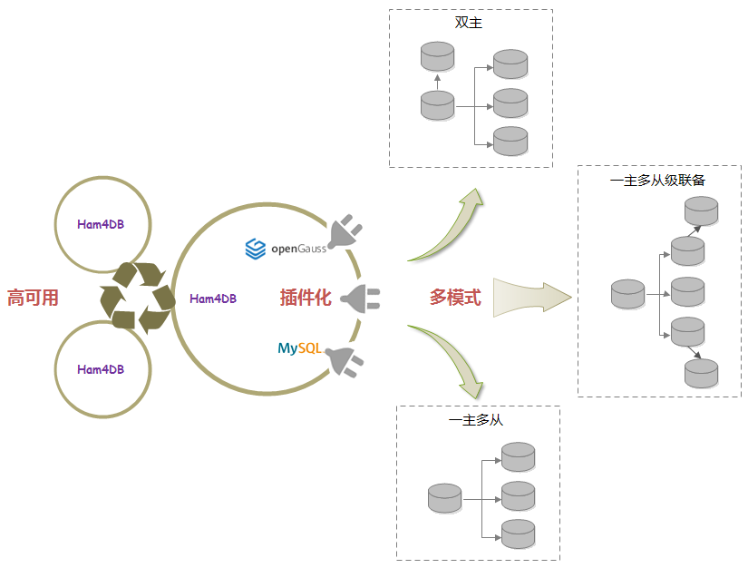
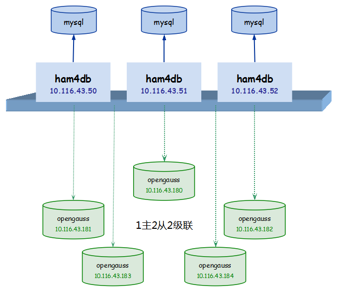
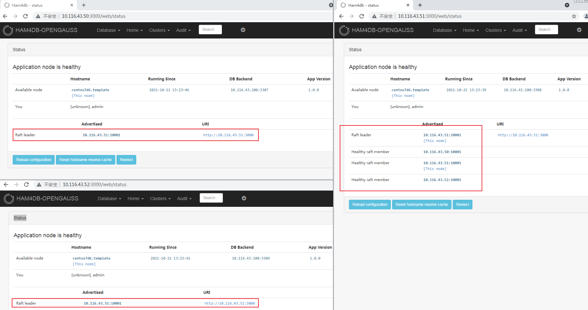
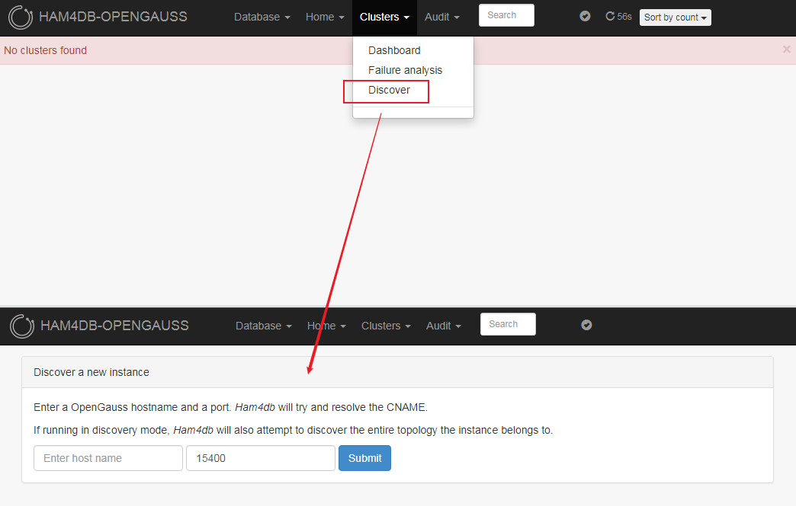
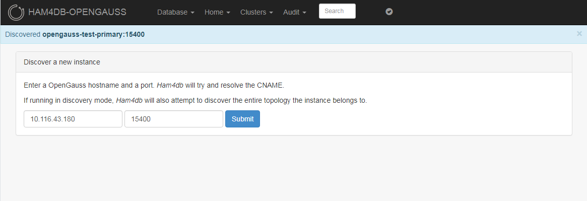
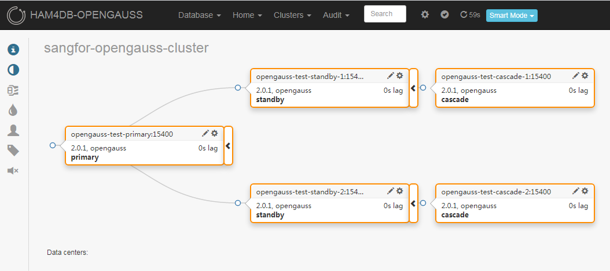

# HAM4DB [[Documentation]](https://gitee.com/opengauss/ham4db/tree/master/docs)

Ham4DB是一个数据库的高可用和复制管理工具，由深信服数据库团队研发，目前支持Mysql和Opengauss（可支持其它类型的数据库），可在一个Ham4DB集群中同时纳管不同类型的数据库集群，其基于开源[Orchestrator](https://github.com/openark/orchestrator)改造而来。为了支持更多类型的数据库，我们对代码进行了大量重构，主要工作如下：
- **模块化重构**。本着高内聚低耦合的思想，将整体逻辑架构拆分为各个独立的模块，主要模块包括：
  - **通用模块**，处理系统层面的功能，与高可用和复制无关的部分，主要目标是提升系统性能、安全性、可管理性、可监测性等，包括：Cache、Log、Metric、Security、System、Limiter等；
  - **专用模块**，参与高可用和复制管理，每个模块内处理相对独立的业务逻辑，主要包括：
     - **基础模块**，用于实例发现、任务管理、数据逻辑处理、配置管理等，主要包括：Base、Discover、Config等；
     - **数据模块**，用于系统初始化、升级、数据库操作、连接管理、适配不同的Backend数据库等，主要包括：DB等；
     - **接口模块**，用于高可用和复制管理，同时也支撑接口化改造，主要包括：Instance、Replication、Topology、Recovery等；
     - **应用模块**，用于提供不同的交互方式，主要包括：Http、Cli等；
     - **运维模块**，用于系统运行维护、高可用管理等，主要包括：Downtime、Consensus、HA、Maintenance、KV等；
     - **适配模块**，用于支持多种数据库，采用适配器模式，主要包括：Adaptor、Agent等；
- **接口化改造**。通过对Instance、Replication、Topology、Recovery等逻辑的抽象，形成接口，不同的纳管数据库需要实现这些接口；
- **适配器模式**。采用可配置方式启动禁用不同的数据库支持，在保留了原有Mysql的高可用处理逻辑下，实现了Opengauss的高可用管理。



# Get Started
* [How To Compile](#how-to-compile)
    * [环境准备](#环境准备)
    * [执行编译](#执行编译)
* [How To Use](#how-to-use)
    * [高可用架构](#高可用架构)
    * [部署准备](#部署准备)
    * [执行部署](#执行部署)
    * [测试纳管](#测试纳管)

## How To Compile
以下编译，以CentOS 7.6为例进行说明：
```
[root@centos7d6 opt]# cat /etc/os-release
NAME="CentOS Linux"
VERSION="7 (Core)"
ID="centos"
ID_LIKE="rhel fedora"
VERSION_ID="7"
PRETTY_NAME="CentOS Linux 7 (Core)"
ANSI_COLOR="0;31"
CPE_NAME="cpe:/o:centos:centos:7"
HOME_URL="https://www.centos.org/"
BUG_REPORT_URL="https://bugs.centos.org/"

CENTOS_MANTISBT_PROJECT="CentOS-7"
CENTOS_MANTISBT_PROJECT_VERSION="7"
REDHAT_SUPPORT_PRODUCT="centos"
REDHAT_SUPPORT_PRODUCT_VERSION="7"

[root@centos7d6 opt]# cat /etc/redhat-release
CentOS Linux release 7.6.1810 (Core)

```
### 环境准备
#### 更新yum源
视具体环境情况而定（Sclo用于安装ruby23），参考镜像源：https://mirrors.tuna.tsinghua.edu.cn/centos
```
[root@centos7d6 opt]# cat /etc/yum.repos.d/CentOS-Base.repo
[base]
name=CentOS-$releasever - Base
baseurl=https://mirrors.tuna.tsinghua.edu.cn/centos/$releasever/os/$basearch/
#mirrorlist=http://mirrorlist.centos.org/?release=$releasever&arch=$basearch&repo=os
gpgcheck=1
gpgkey=file:///etc/pki/rpm-gpg/RPM-GPG-KEY-CentOS-7

#released updates
[updates]
name=CentOS-$releasever - Updates
baseurl=https://mirrors.tuna.tsinghua.edu.cn/centos/$releasever/updates/$basearch/
#mirrorlist=http://mirrorlist.centos.org/?release=$releasever&arch=$basearch&repo=updates
gpgcheck=1
gpgkey=file:///etc/pki/rpm-gpg/RPM-GPG-KEY-CentOS-7

#additional packages that may be useful
[extras]
name=CentOS-$releasever - Extras
baseurl=https://mirrors.tuna.tsinghua.edu.cn/centos/$releasever/extras/$basearch/
#mirrorlist=http://mirrorlist.centos.org/?release=$releasever&arch=$basearch&repo=extras
gpgcheck=1
gpgkey=file:///etc/pki/rpm-gpg/RPM-GPG-KEY-CentOS-7

#additional packages that extend functionality of existing packages
[centosplus]
name=CentOS-$releasever - Plus
baseurl=https://mirrors.tuna.tsinghua.edu.cn/centos/$releasever/centosplus/$basearch/
#mirrorlist=http://mirrorlist.centos.org/?release=$releasever&arch=$basearch&repo=centosplus
gpgcheck=1
enabled=0
gpgkey=file:///etc/pki/rpm-gpg/RPM-GPG-KEY-CentOS-7

[sclo]
name=CentOS-$releasever -  Sclo
baseurl=https://mirrors.tuna.tsinghua.edu.cn/centos/$releasever/sclo/$basearch/rh
#mirrorlist=http://mirrorlist.centos.org/?release=$releasever&arch=$basearch&repo=sclo
gpgcheck=0
gpgkey=file:///etc/pki/rpm-gpg/RPM-GPG-KEY-CentOS

```
#### 安装依赖
编译所需依赖如下：go、ruby、fpm，安装过程如下：
##### 安装go
go 1.16+，解压至/opt下，并添加至PATH中。
```
[root@centos7d6 opt]# tar -xvf go1.16.4.linux-amd64.tar.gz
... ...
go/test/zerodivide.go
[root@centos7d6 opt]# cat ~/.bashrc
# .bashrc

# User specific aliases and functions

alias rm='rm -i'
alias cp='cp -i'
alias mv='mv -i'

# Source global definitions
if [ -f /etc/bashrc ]; then
        . /etc/bashrc
fi

export PATH=/opt/go/bin:$PATH

[root@centos7d6 opt]# source ~/.bashrc
[root@centos7d6 opt]# go version
go version go1.16.4 linux/amd64
```
##### 安装ruby23
```
[root@centos7d6 opt]# yum install -y rh-ruby23-rubygems rh-ruby23-ruby rh-ruby23-ruby-devel
... ...

  rh-ruby23-runtime.x86_64 0:2.2-7.el7                              scl-utils.x86_64 0:20130529-19.el7

Complete!

[root@centos7d6 opt]# scl enable rh-ruby23 bash
[root@centos7d6 opt]# ruby -v
ruby 2.3.8p459 (2018-10-18 revision 65136) [x86_64-linux]

```
##### 安装fpm
配置gem源，参考镜像源：https://mirrors.tuna.tsinghua.edu.cn/rubygems/
```
[root@centos7d6 opt]# gem sources --add https://mirrors.tuna.tsinghua.edu.cn/rubygems/ --remove https://rubygems.org/
https://mirrors.tuna.tsinghua.edu.cn/rubygems/ added to sources
https://rubygems.org/ removed from sources

[root@centos7d6 opt]# gem install fpm
... ...
Done installing documentation for rexml, stud, rchardet, git, dotenv, insist, mustache, clamp, cabin, pleaserun, arr-pm, backports, fpm after 14 seconds
13 gems installed
```
### 执行编译
#### Ham4DB编译
进入源码目录，假设为：/home/source/go/src/gitee.com/opengauss/ham4db。
```
[root@centos7d6 ham4db]# GO111MODULE=auto GOPATH=/home/source/go ./build.sh -d
+ main linux systemd amd64 /usr/local ''
+ local target=linux
... ...
+ export message
+ echo '[DEBUG] ham4db build done; exit status is 0'
[DEBUG] ham4db build done; exit status is 0

```
编译结束后，可执行文件位于源码目录：build/bin/ham4db
```
[root@centos7d6 ham4db]# ./build/bin/ham4db -version
1.0.0
507ab77e45c2dc30ab7eb8032c97aa35e22bfedb

```
#### Agent编译
源码目录下，执行如下命令，编译生成opengauss agent。
```
[root@centos7d6 ham4db]# GO111MODULE=auto GOPATH=/home/source/go go build -o opengauss-agent go/agent/server/server.go
[root@centos7d6 ham4db]# ll opengauss-agent
-rwxr-xr-x.  1 root root 17457168 Sep 29 16:01 opengauss-agent
```

## How To Use
### 高可用架构
高可用部署架构如下所示：<br>


其中：
* ham4db共3个实例，保证高可用，每个ham4db采用独立的mysql用于存储数据；
* opengauss共5个实例，采用1主2从2级联的配置；

### 部署准备
部署之前，需要准备运行所需的文件。

#### 后端数据库
每个实例都有自己的后端数据库，用于存储ham4db的数据，以Mysql 5.7为例，创建ham4db使用的用户及权限。

```
mysql> create user 'ham4db'@'%' identified by 'ham4db';
Query OK, 0 rows affected (0.00 sec)

mysql> grant all privileges on `ham4db`.* to 'ham4db'@'%';
Query OK, 0 rows affected (0.01 sec)

```
#### 文件列表
运行所需文件如下，包括：前述步骤([执行编译](#执行编译))编译后的二进制文件ham4db、源码目录conf下ham4db.conf.json、源码目录下静态文件目录resources。
```
[root@centos7d6 ham4db]# ll
total 25532
-rwxr-xr-x. 1 root root 26135144 Sep 29 11:30 ham4db
-rw-r--r--. 1 root root     5721 Sep 29 11:44 ham4db.conf.json
drwxr-xr-x. 7 root root       82 Sep 29 11:31 resources
```

将上述3者，放到一个目录中。
#### 配置文件
修改ham4db.conf.json配置文件中数据库部分的设置(替换为真实环境中的ip和port)，包括：BackendDBHost、BackendDBPort，其余根据需要修改或者保留默认即可。
```
  "BackendDBHost": "172.18.0.1",
  "BackendDBPort": 3306,

```

### 执行部署
#### Ham4DB部署
##### 单机部署
建议非生产环境下使用，可直接执行如下命令，启动ham4db。
```
[root@centos7d6 ham4db]# ./ham4db -config ham4db.conf.json -stack -verbose http
2021-10-22 15:21:19 INFO starting ham4db, version: 1.0.0, git commit: 323deb7f68cc25dc1364aff3877cd99b4a16f9c4
2021-10-22 15:21:39 INFO Starting Discovery
2021-10-22 15:21:39 INFO Registering endpoints
2021-10-22 15:21:39 INFO continuous discovery: setting up
2021-10-22 15:21:39 INFO continuous discovery: starting
2021-10-22 15:21:39 INFO Starting HTTP listener on 0.0.0.0:3000
2021-10-22 15:21:40 INFO Waiting for 15 seconds to pass before running failure detection/recovery
... ...
```
浏览器中访问当前机器的3000端口即可。

##### 高可用部署
###### 修改配置
* 请修改每个ham4db的配置文件，使其能够采用独立的mysql；
* 修改raft部分的配置，参考如下（以10.116.43.50为例，其余节点需要修改RaftBind）：

```
  ... ...
  "RaftEnabled": true,
  "RaftDataDir": "/tmp/ham4db-1",
  "RaftBind": "10.116.43.50:10001",
  "RaftNodes": [
    "10.116.43.50:10001",
    "10.116.43.51:10001",
    "10.116.43.52:10001"
  ],
  ... ...

```

###### 访问web ui
执行如下命令，启动ham4db（在3台机器上分别启动ham4db）。
```
[root@centos7d6 ham4db]# ./ham4db -config ham4db.conf.json -stack -verbose http
2021-10-21 21:23:25 INFO starting ham4db, version: 1.0.0, git commit: 323deb7f68cc25dc1364aff3877cd99b4a16f9c4
2021-10-21 21:23:47 INFO Starting Discovery
2021-10-21 21:23:47 INFO Registering endpoints
2021-10-21 21:23:47 INFO continuous discovery: setting up
2021-10-21 21:23:47 INFO raft: store initialized at /tmp/ham4db-1/raft_store.db
2021-10-21 21:23:47 INFO Starting HTTP listener on 0.0.0.0:3000
2021-10-21 21:23:47 INFO new raft created
2021-10-21 21:23:47 INFO continuous discovery: starting
2021-10-21 21:23:47 INFO  raft: Node at 10.116.43.50:10001 [Follower] entering Follower state (Leader: "")
2021/10/21 21:23:47 [DEBUG] raft-net: 10.116.43.50:10001 accepted connection from: 10.116.43.51:40258
2021-10-21 21:23:48 INFO Waiting for 15 seconds to pass before running failure detection/recovery
... ...
```

访问三个实例的3000端口，展示如下(3个ham4db实例的Home->Status页面)：



##### Agent部署
 * 在opengauss数据库节点所在的server上，添加一个service，配置文件如下：

```
[root@c-node-1 ~]# cat /usr/lib/systemd/system/opengauss-agent.service
[Unit]
Description=OpenGauss Agent For Ham4db

[Service]
User=omm
Group=dbgrp
Type=simple
ExecStart=/bin/bash -l -c '/usr/sbin/opengauss-agent'
Restart=always
RestartSec=5
KillMode=process

[Install]
WantedBy=multi-user.target

```
并将前述生成的opengauss-agent（[agent编译](#agent编译)）拷贝到server目录：/usr/sbin。**注意：配置文件中的User和Group需要跟opengauss实例运行的user和group保持一致；**
 * 使用systemctl启动并查看opengauss-agent service，出现“agent has been started successfully”代表启动成功；
 * 执行rest api进行测试，成功返回Opengauss集群的cluster name代表agent可以访问Opengauss。

参考如下：
```
[root@centos7d6 ham4db]# ll /usr/sbin/opengauss-agent
-rwxr-xr-x. 1 root root 17457168 Sep 29 16:01 /usr/sbin/opengauss-agent

[root@centos7d6 ham4db]# systemctl start opengauss-agent
[root@centos7d6 ham4db]# systemctl status opengauss-agent
● opengauss-agent.service - OpenGauss Agent For Ham4db
   Loaded: loaded (/usr/lib/systemd/system/opengauss-agent.service; disabled; vendor preset: disabled)
   Active: active (running) since Wed 2021-09-29 16:14:38 CST; 13s ago
 Main PID: 387 (opengauss-agent)
   CGroup: /system.slice/opengauss-agent.service
           └─387 /usr/sbin/opengauss-agent

Sep 29 16:14:38 centos7d6.template systemd[1]: Started OpenGauss Agent For Ham4db.
Sep 29 16:14:38 centos7d6.template bash[387]: 2021-09-29 16:14:38 INFO start agent
Sep 29 16:14:38 centos7d6.template bash[387]: 2021-09-29 16:14:38 WARNING no server address in args:&{ 0.0.0.0 15000 5 false 300}, so will not do health check
Sep 29 16:14:38 centos7d6.template bash[387]: 2021-09-29 16:14:38 INFO run worker:GrpcServer
Sep 29 16:14:38 centos7d6.template bash[387]: 2021-09-29 16:14:38 INFO run worker:StopGrpcServer
Sep 29 16:14:38 centos7d6.template bash[387]: 2021-09-29 16:14:38 INFO run worker:HttpServer
Sep 29 16:14:38 centos7d6.template bash[387]: 2021-09-29 16:14:38 INFO run worker:StopHttpServer
Sep 29 16:14:38 centos7d6.template bash[387]: 2021-09-29 16:14:38 INFO run worker:AgentRefreshBaseInfo
Sep 29 16:14:38 centos7d6.template bash[387]: 2021-09-29 16:14:38 INFO agent has been started successfully

[root@centos7d6 ham4db]# curl http://10.116.43.180:15001
sangfor-opengauss-cluster
```
#### 测试纳管
UI默认是Opengauss纳管，可通过Database->Mysql切换为Myql纳管。

##### 注册Opengauss实例
确保每一个opengauss实例的节点上都已经部署opengauss-agent并运行正常，并确保ham4db实例所在的服务器能够解析opengauss实例所在服务器的主机名（添加至/etc/hosts中或者通过dns）。访问ham4db，注册需要纳管的opengauss，填写其对应的ip和port；



discover成功后，如下所示：



通过自动拓扑发现，可快速呈现整个拓扑结构，最终集群如下所示：


