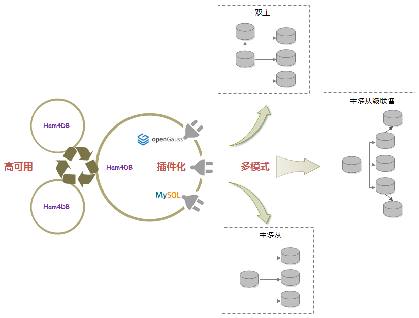
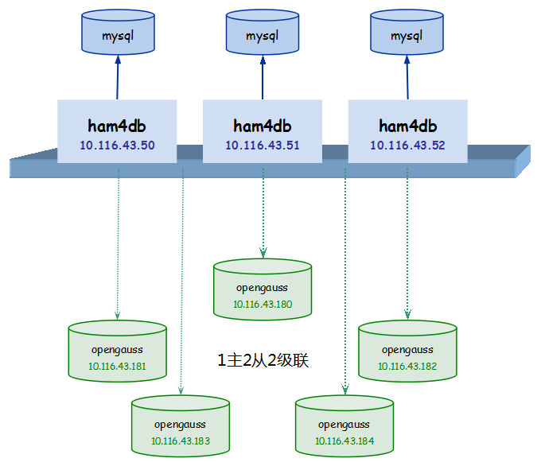
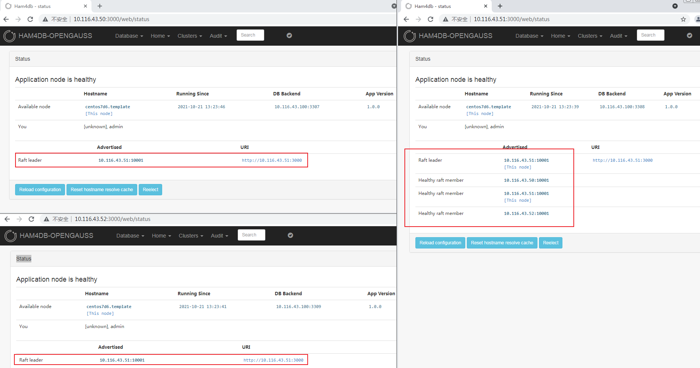
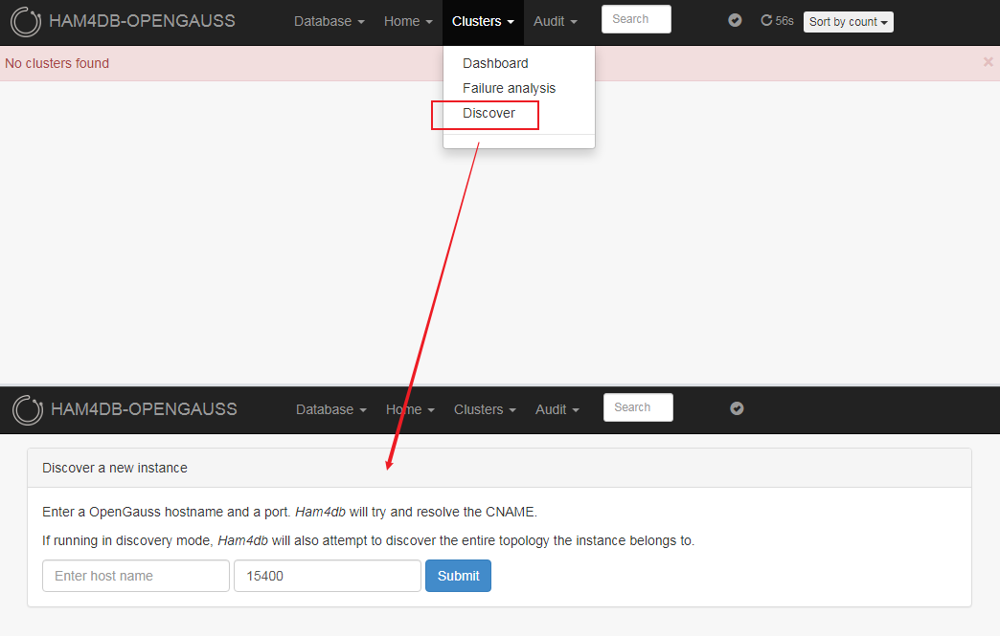
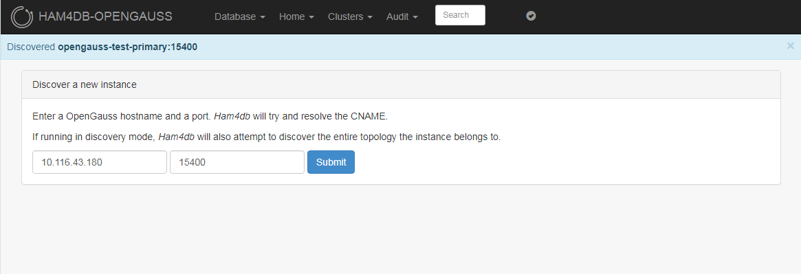
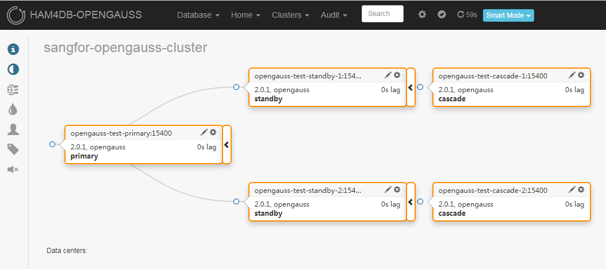

# HAM4DB [[Documentation]](https://gitee.com/opengauss/ham4db/tree/master/docs)

Ham4DB is a database high-availability and replication management tool developed by the Sangfor database team. It currently supports MySQL and openGauss (and can be extended to other types of databases). A single Ham4DB cluster can manage multiple types of database clusters. Ham4DB is based on the open-source [Orchestrator](https://github.com/openark/orchestrator) and has been extensively refactored to support more database types. Key improvements include:
- Modular Refactoring: Following the principles of high cohesion and low coupling, the architecture is divided into independent modules:
  - Common Modules: Handle system-level functions unrelated to high availability or replication. They aim to improve system performance, security, manageability, and monitoring. Examples: Cache, Log, Metric, Security, System, Limiter.
  - Specialized Modules: Participate in high availability and replication management, each handling independent business logic:
     - Core Modules: Instance discovery, task management, data logic, and configuration management (Base, Discover, Config).
     - Data Modules: System initialization, upgrades, database operations, connection management, backend database adaptation (DB).
     - Interface Modules: High-availability and replication management, supporting API abstraction (Instance, Replication, Topology, Recovery).
     - Application Modules: Provide interaction methods (HTTP, CLI).
     - Operations Modules: System maintenance and HA management (Downtime, Consensus, HA, Maintenance, KV).
     - Adapter Modules: Enable support for multiple databases using the adapter pattern (Adapter, Agent).
- Interface Abstraction: Logical modules like Instance, Replication, Topology, and Recovery are abstracted as interfaces. Each managed database type must implement these interfaces.
- Adapter Pattern: Different database support can be enabled or disabled via configuration. MySQL HA logic remains, while openGauss HA is fully supported.



# Get Started
* [How To Compile](#how-to-compile)
    * [Environment Preparation](#Environment-Preparation)
    * [Compilation Execution](#Compilation-Execution)
* [How To Use](#how-to-use)
    * [HA Architecture](#HA-Architecture)
    * [Deployment Preparation](#Deployment-Preparation)
    * [Deployment Execution](#Deployment-Execution)
    * [Test Management](#Test-Management)

## How To Compile
The following uses CentOS 7.6 as an example.
```
[root@centos7d6 opt]# cat /etc/os-release
NAME="CentOS Linux"
VERSION="7 (Core)"
ID="centos"
ID_LIKE="rhel fedora"
VERSION_ID="7"
PRETTY_NAME="CentOS Linux 7 (Core)"
ANSI_COLOR="0;31"
CPE_NAME="cpe:/o:centos:centos:7"
HOME_URL="https://www.centos.org/"
BUG_REPORT_URL="https://bugs.centos.org/"

CENTOS_MANTISBT_PROJECT="CentOS-7"
CENTOS_MANTISBT_PROJECT_VERSION="7"
REDHAT_SUPPORT_PRODUCT="centos"
REDHAT_SUPPORT_PRODUCT_VERSION="7"

[root@centos7d6 opt]# cat /etc/redhat-release
CentOS Linux release 7.6.1810 (Core)

```
### Environment Preparation
#### Updating the yum Repository
Depending on the specific environment (Sclo is used to install Ruby23). For details, see the image source: https://mirrors.tuna.tsinghua.edu.cn/centos
```
[root@centos7d6 opt]# cat /etc/yum.repos.d/CentOS-Base.repo
[base]
name=CentOS-$releasever - Base
baseurl=https://mirrors.tuna.tsinghua.edu.cn/centos/$releasever/os/$basearch/
#mirrorlist=http://mirrorlist.centos.org/?release=$releasever&arch=$basearch&repo=os
gpgcheck=1
gpgkey=file:///etc/pki/rpm-gpg/RPM-GPG-KEY-CentOS-7

#released updates
[updates]
name=CentOS-$releasever - Updates
baseurl=https://mirrors.tuna.tsinghua.edu.cn/centos/$releasever/updates/$basearch/
#mirrorlist=http://mirrorlist.centos.org/?release=$releasever&arch=$basearch&repo=updates
gpgcheck=1
gpgkey=file:///etc/pki/rpm-gpg/RPM-GPG-KEY-CentOS-7

#additional packages that may be useful
[extras]
name=CentOS-$releasever - Extras
baseurl=https://mirrors.tuna.tsinghua.edu.cn/centos/$releasever/extras/$basearch/
#mirrorlist=http://mirrorlist.centos.org/?release=$releasever&arch=$basearch&repo=extras
gpgcheck=1
gpgkey=file:///etc/pki/rpm-gpg/RPM-GPG-KEY-CentOS-7

#additional packages that extend functionality of existing packages
[centosplus]
name=CentOS-$releasever - Plus
baseurl=https://mirrors.tuna.tsinghua.edu.cn/centos/$releasever/centosplus/$basearch/
#mirrorlist=http://mirrorlist.centos.org/?release=$releasever&arch=$basearch&repo=centosplus
gpgcheck=1
enabled=0
gpgkey=file:///etc/pki/rpm-gpg/RPM-GPG-KEY-CentOS-7

[sclo]
name=CentOS-$releasever -  Sclo
baseurl=https://mirrors.tuna.tsinghua.edu.cn/centos/$releasever/sclo/$basearch/rh
#mirrorlist=http://mirrorlist.centos.org/?release=$releasever&arch=$basearch&repo=sclo
gpgcheck=0
gpgkey=file:///etc/pki/rpm-gpg/RPM-GPG-KEY-CentOS

```
#### Dependency Installation
Dependencies: Go, Ruby, FPM.
##### Installing Go
Go 1.16 or later: Decompress the package to the `/opt` directory and add it to `PATH`.
```
[root@centos7d6 opt]# tar -xvf go1.16.4.linux-amd64.tar.gz
... ...
go/test/zerodivide.go
[root@centos7d6 opt]# cat ~/.bashrc
# .bashrc

# User specific aliases and functions

alias rm='rm -i'
alias cp='cp -i'
alias mv='mv -i'

# Source global definitions
if [ -f /etc/bashrc ]; then
        . /etc/bashrc
fi

export PATH=/opt/go/bin:$PATH

[root@centos7d6 opt]# source ~/.bashrc
[root@centos7d6 opt]# go version
go version go1.16.4 linux/amd64
```
##### Installing Ruby23
```
[root@centos7d6 opt]# yum install -y rh-ruby23-rubygems rh-ruby23-ruby rh-ruby23-ruby-devel
... ...

  rh-ruby23-runtime.x86_64 0:2.2-7.el7                              scl-utils.x86_64 0:20130529-19.el7

Complete!

[root@centos7d6 opt]# scl enable rh-ruby23 bash
[root@centos7d6 opt]# ruby -v
ruby 2.3.8p459 (2018-10-18 revision 65136) [x86_64-linux]

```
##### Installing FPM
Configure the GEM source. For details, see the image source: https://mirrors.tuna.tsinghua.edu.cn/rubygems/
```
[root@centos7d6 opt]# gem sources --add https://mirrors.tuna.tsinghua.edu.cn/rubygems/ --remove https://rubygems.org/
https://mirrors.tuna.tsinghua.edu.cn/rubygems/ added to sources
https://rubygems.org/ removed from sources

[root@centos7d6 opt]# gem install fpm
... ...
Done installing documentation for rexml, stud, rchardet, git, dotenv, insist, mustache, clamp, cabin, pleaserun, arr-pm, backports, fpm after 14 seconds
13 gems installed
```
### Compilation Execution
#### Compiling Ham4DB
Go to the source code directory, for example, `/home/source/go/src/gitee.com/opengauss/ham4db`.
```
[root@centos7d6 ham4db]# GO111MODULE=auto GOPATH=/home/source/go ./build.sh -d
+ main linux systemd amd64 /usr/local ''
+ local target=linux
... ...
+ export message
+ echo '[DEBUG] ham4db build done; exit status is 0'
[DEBUG] ham4db build done; exit status is 0

```
After the compilation is complete, the executable file is stored in the source code directory: `build/bin/ham4db`.
```
[root@centos7d6 ham4db]# ./build/bin/ham4db -version
1.0.0
507ab77e45c2dc30ab7eb8032c97aa35e22bfedb

```
#### Agent Compilation
In the source code directory, run the following commands to compile and generate the openGauss agent:
```
[root@centos7d6 ham4db]# GO111MODULE=auto GOPATH=/home/source/go go build -o opengauss-agent go/agent/server/server.go
[root@centos7d6 ham4db]# ll opengauss-agent
-rwxr-xr-x.  1 root root 17457168 Sep 29 16:01 opengauss-agent
```

## How To Use
### HA Architecture
The following figure shows the HA deployment architecture.<br>


Deployment architecture:
* 3 Ham4DB instances for HA, each with a separate MySQL backend for data storage.
* 5 openGauss instances, with 1 primary, 2 standby, and 2 cascade nodes.

### Deployment Preparations
Before the deployment, prepare the required files.

#### Backend Database
Each instance has its own backend database for storing Ham4DB data. The following uses MySQL 5.7 as an example to describe how to create a user and grant permissions for Ham4DB.

```
mysql> create user 'ham4db'@'%' identified by 'ham4db';
Query OK, 0 rows affected (0.00 sec)

mysql> grant all privileges on `ham4db`.* to 'ham4db'@'%';
Query OK, 0 rows affected (0.01 sec)

```
#### File List
The files required for running include the compiled binary file `ham4db`, the `ham4db.conf.json` file in the `conf` directory of the source code, and the static file directory `resources` in the source code directory.
```
[root@centos7d6 ham4db]# ll
total 25532
-rwxr-xr-x. 1 root root 26135144 Sep 29 11:30 ham4db
-rw-r--r--. 1 root root     5721 Sep 29 11:44 ham4db.conf.json
drwxr-xr-x. 7 root root       82 Sep 29 11:31 resources
```

Place the three files in the same directory.
#### Configuration File
Modify the database settings in the `ham4db.conf.json` configuration file (replace the IP address and port number with the actual ones), including `BackendDBHost` and `BackendDBPort`. Modify other settings as required or retain the default values.
```
  "BackendDBHost": "172.18.0.1",
  "BackendDBPort": 3306,

```

### Performing the Deployment
#### Ham4DB Deployment
##### Single-node deployment
You are advised to run the following commands to start ham4db in a non-production environment:
```
[root@centos7d6 ham4db]# ./ham4db -config ham4db.conf.json -stack -verbose http
2021-10-22 15:21:19 INFO starting ham4db, version: 1.0.0, git commit: 323deb7f68cc25dc1364aff3877cd99b4a16f9c4
2021-10-22 15:21:39 INFO Starting Discovery
2021-10-22 15:21:39 INFO Registering endpoints
2021-10-22 15:21:39 INFO continuous discovery: setting up
2021-10-22 15:21:39 INFO continuous discovery: starting
2021-10-22 15:21:39 INFO Starting HTTP listener on 0.0.0.0:3000
2021-10-22 15:21:40 INFO Waiting for 15 seconds to pass before running failure detection/recovery
... ...
```
Access port 3000 of the current host in the browser.

##### HA deployment
###### Modifying the configuration
* Modify the configuration file of each `ham4db` to enable it to use an independent MySQL database.
* Modify the `Raft` configuration. The following uses 10.116.43.50 as an example. For other nodes, modify `RaftBind`.

```
  ... ...
  "RaftEnabled": true,
  "RaftDataDir": "/tmp/ham4db-1",
  "RaftBind": "10.116.43.50:10001",
  "RaftNodes": [
    "10.116.43.50:10001",
    "10.116.43.51:10001",
    "10.116.43.52:10001"
  ],
  ... ...

```

###### Accessing the web UI
Run the following commands to start `ham4db` on the three servers:
```
[root@centos7d6 ham4db]# ./ham4db -config ham4db.conf.json -stack -verbose http
2021-10-21 21:23:25 INFO starting ham4db, version: 1.0.0, git commit: 323deb7f68cc25dc1364aff3877cd99b4a16f9c4
2021-10-21 21:23:47 INFO Starting Discovery
2021-10-21 21:23:47 INFO Registering endpoints
2021-10-21 21:23:47 INFO continuous discovery: setting up
2021-10-21 21:23:47 INFO raft: store initialized at /tmp/ham4db-1/raft_store.db
2021-10-21 21:23:47 INFO Starting HTTP listener on 0.0.0.0:3000
2021-10-21 21:23:47 INFO new raft created
2021-10-21 21:23:47 INFO continuous discovery: starting
2021-10-21 21:23:47 INFO  raft: Node at 10.116.43.50:10001 [Follower] entering Follower state (Leader: "")
2021/10/21 21:23:47 [DEBUG] raft-net: 10.116.43.50:10001 accepted connection from: 10.116.43.51:40258
2021-10-21 21:23:48 INFO Waiting for 15 seconds to pass before running failure detection/recovery
... ...
```

Visit port 3000 on all three Ham4DB instances to view their Home -> Status page:



##### Agent deployment
 * On the server hosting the openGauss database node, add a service with the following configuration:

```
[root@c-node-1 ~]# cat /usr/lib/systemd/system/opengauss-agent.service
[Unit]
Description=OpenGauss Agent For Ham4db

[Service]
User=omm
Group=dbgrp
Type=simple
ExecStart=/bin/bash -l -c '/usr/sbin/opengauss-agent'
Restart=always
RestartSec=5
KillMode=process

[Install]
WantedBy=multi-user.target

```
Copy the generated `openGauss-agent` ([Agent Compilation](#Agent-Compilation)) to the `server` directory `/usr/sbin`. Note: The `User` and `Group` in the configuration must match the openGauss instance user and group.
 * Use `systemctl` to start and check the `openGauss-agent` service. If the message "agent has been started successfully" is displayed, the service has been started successfully.
 * Execute the REST API for testing. If the cluster name of the openGauss cluster is returned successfully, the agent can access openGauss.

Example:
```
[root@centos7d6 ham4db]# ll /usr/sbin/opengauss-agent
-rwxr-xr-x. 1 root root 17457168 Sep 29 16:01 /usr/sbin/opengauss-agent

[root@centos7d6 ham4db]# systemctl start opengauss-agent
[root@centos7d6 ham4db]# systemctl status opengauss-agent
● opengauss-agent.service - OpenGauss Agent For Ham4db
   Loaded: loaded (/usr/lib/systemd/system/opengauss-agent.service; disabled; vendor preset: disabled)
   Active: active (running) since Wed 2021-09-29 16:14:38 CST; 13s ago
 Main PID: 387 (opengauss-agent)
   CGroup: /system.slice/opengauss-agent.service
           └─387 /usr/sbin/opengauss-agent

Sep 29 16:14:38 centos7d6.template systemd[1]: Started OpenGauss Agent For Ham4db.
Sep 29 16:14:38 centos7d6.template bash[387]: 2021-09-29 16:14:38 INFO start agent
Sep 29 16:14:38 centos7d6.template bash[387]: 2021-09-29 16:14:38 WARNING no server address in args:&{ 0.0.0.0 15000 5 false 300}, so will not do health check
Sep 29 16:14:38 centos7d6.template bash[387]: 2021-09-29 16:14:38 INFO run worker:GrpcServer
Sep 29 16:14:38 centos7d6.template bash[387]: 2021-09-29 16:14:38 INFO run worker:StopGrpcServer
Sep 29 16:14:38 centos7d6.template bash[387]: 2021-09-29 16:14:38 INFO run worker:HttpServer
Sep 29 16:14:38 centos7d6.template bash[387]: 2021-09-29 16:14:38 INFO run worker:StopHttpServer
Sep 29 16:14:38 centos7d6.template bash[387]: 2021-09-29 16:14:38 INFO run worker:AgentRefreshBaseInfo
Sep 29 16:14:38 centos7d6.template bash[387]: 2021-09-29 16:14:38 INFO agent has been started successfully

[root@centos7d6 ham4db]# curl http://10.116.43.180:15001
sangfor-opengauss-cluster
```
#### Testing Management
By default, the UI is managed by openGauss. You can choose Database > MySQL to switch to MySQL management.

##### Registering an openGauss Instance
Ensure each openGauss node has a running `opengauss-agent`. Ensure that the server running Ham4DB can resolve the host names of all openGauss nodes (either via `/etc/hosts` or DNS). Open Ham4DB, register the openGauss instances to be managed, and enter their corresponding IP and port.



After successful discovery:



Automatic topology discovery quickly displays the entire topology structure. The final cluster is as follows:


